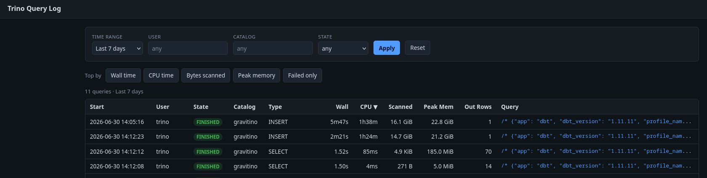

# trino-query-log-sink

Trino query coordinator shows statistics about queries in the last 10 minutes,
for clusters with high churn rate that is not an enough window to review queries performance,
Trino offers a way to register an [events listener](https://trino.io/docs/current/admin/event-listeners-http.html) that receives the events encoded in json format,
this app can be registered as an event listener to receive and persist these events on a gcs bucket
in [iceberg](https://trino.io/docs/current/connector/iceberg.html) format, and provide a simple UI to browse the performance and query plans for each event.



The app can run in 2 modes, first as a single app for both events consumption and UI using the `serve` command,
or in two separate apps one for ingestion use `ingest` command and one for ui using `ui` command.

```
Trino coordinator ──(HTTP event listener, POST JSON)──▶ ingest /ingest
   buffer (batched) ──INSERT via Trino──▶ Iceberg <catalog>.<schema>.<table>
   ui ──SELECT via Trino──▶ browse + per-query detail
```

## Subcommands

The single binary has several modes (configuration always comes from the environment):

| Command | Purpose |
|---------|---------|
| `serve` (default) | Run the ingest endpoint **and** the web UI in one process. |
| `ingest` | Run only the ingest endpoint (write path) — for a separate ingest deployment. |
| `ui` | Run only the read UI (read path) — for a separate, independently-scaled deployment. |
| `init` | Apply the schema + table DDL once (needs `CREATE` privileges). |
| `prune` | Delete rows older than `RETENTION_DAYS` (run as a CronJob). |
| `maintain` | Compact files + expire snapshots/orphans via Iceberg procedures (CronJob). |
| `ddl` | Print the DDL to stdout. |

`serve` is the simplest single-deployment option; `ingest` + `ui` split the write
and read paths so the UI can scale and restart without touching ingestion. All
three share the same configuration; `/healthz`, `/readyz`, and `/metrics` are
present in every mode, `/ingest` only in `serve`/`ingest`, and the UI routes only
in `serve`/`ui`.

> **Why `maintain`?** Writing one INSERT per flush through Trino creates many
> small Iceberg files and a snapshot per commit, and `prune`'s `DELETE` writes
> delete-files rather than reclaiming space. The `maintain` job runs
> [`optimize`](https://trino.io/docs/current/connector/iceberg.html#optimize) +
> [`expire_snapshots`](https://trino.io/docs/current/connector/iceberg.html#expire-snapshots) +
> [`remove_orphan_files`](https://trino.io/docs/current/connector/iceberg.html#remove-orphan-files) so the table stays
> compact and storage is actually freed. Schedule it after `prune`.

## Endpoints

- `POST /ingest` — accepts a [`QueryCompletedEvent`](https://trino.io/docs/current/admin/event-listeners-http.html); responds `202` quickly.
- `GET /` — dashboard: filter by time range / user / catalog / state, sort by
  start / wall / CPU / bytes scanned / peak memory / output rows, "top by"
  shortcuts, and a failed-only toggle.
- `GET /query/{queryId}` — full SQL, statistics, plan(s), per-table input bytes,
  and failure details.
- `GET /healthz` — liveness. `GET /readyz` — ready only when the table is
  reachable. `GET /metrics` — Prometheus counters (if enabled).

## Configuration

| Variable | Default | Notes |
|----------|---------|-------|
| `LISTEN_ADDR` | `:8080` | HTTP listen address. |
| `TRINO_HOST` | `trino-cluster-trino.trino` | Coordinator host. |
| `TRINO_PORT` | `8080` | Coordinator HTTP port. |
| `TRINO_USER` | `trino-query-log` | Trino user. |
| `TRINO_SOURCE` | `trino-query-log` | Session source; events with this source are suppressed. |
| `TRINO_CATALOG` | `gravitino` | Iceberg catalog. |
| `TRINO_SCHEMA` | `observability` | Schema. |
| `TRINO_TABLE` | `trino_query_log` | Table. |
| `ICEBERG_LOCATION` | *(empty)* | Warehouse path (e.g. `gs://bucket/observability`) used by `init`/`ddl`. |
| `BATCH_SIZE` | `100` | Max rows per flush. |
| `FLUSH_INTERVAL` | `5s` | Max time before a partial batch flushes (manifests set `30s`). |
| `BUFFER_CAPACITY` | `10000` | In-memory queue depth; events are dropped when full. |
| `FLUSH_MAX_RETRIES` | `3` | Retries per failed flush before the batch is dropped. |
| `RETENTION_DAYS` | `7` | Used by `prune`. |
| `MAINTAIN_RETENTION` | `7d` | Snapshot/orphan age threshold for `maintain` (Trino enforces a catalog minimum). |
| `METRICS_ENABLED` | `true` | Expose `/metrics` (Prometheus text). |
| `LOG_LEVEL` | `info` | `debug`/`info`/`warn`/`error`. |
| `TRINO_PASSWORD` | *(empty)* | Optional [basic-auth password](https://trino.io/docs/current/security/password-file.html). |
| `TRINO_ACCESS_TOKEN` | *(empty)* | Optional [bearer/JWT token](https://trino.io/docs/current/security/jwt.html). |
| `TRINO_SSL` | `false` | Use [HTTPS/TLS](https://trino.io/docs/current/security/tls.html) to the coordinator. |
| `TRINO_QUERY_TIMEOUT` | `60s` | Per-query timeout; also bounds each flush. |
| `REDIS_ADDR` | *(empty)* | Optional read-through cache backend (`host:6379`). **Empty disables the cache** and the service reads Trino directly. |
| `REDIS_PASSWORD` | *(empty)* | Cache password / Memorystore AUTH string. |
| `REDIS_DB` | `0` | Cache logical database. |
| `REDIS_TLS` | `false` | Connect to the cache over TLS (e.g. Memorystore in-transit encryption). |
| `CACHE_LIST_TTL` | `10m` | Dashboard/list result TTL. |
| `CACHE_QUERY_TTL` | `1h` | Per-query detail TTL (completed queries are immutable). |
| `CACHE_TIMEOUT` | `250ms` | Per-operation cache deadline; bounds added latency when the cache is slow/down. |

## Quick start (local, against a port-forwarded Trino)

```bash
# 1. Reach the in-cluster coordinator.
kubectl -n trino port-forward svc/trino-cluster-trino 8080:8080 &

# 2. Build.
go build -o bin/trino-query-log-sink ./cmd/trino-query-log-sink

# 3. Create the schema + table (needs CREATE privileges).
TRINO_HOST=localhost ICEBERG_LOCATION=gs://your-warehouse/observability \
  ./bin/trino-query-log-sink init

# 4. Run the service.
TRINO_HOST=localhost ./bin/trino-query-log-sink serve

# 5. Post a sample event and open the UI.
scripts/curl-ingest.sh http://localhost:8080
open http://localhost:8080
```

To only see the DDL: `./bin/trino-query-log-sink ddl` (or apply
[`ddl/trino_query_log.sql`](ddl/trino_query_log.sql) by hand).

## Deploy

Manifests in [`deploy/k8s`](deploy/k8s) target namespace `trino`. Edit the image
reference and the `ConfigMap`/`Secret`, then apply the config, deployment, and service:

```bash
kubectl apply -f deploy/k8s/configmap.yaml -f deploy/k8s/secret.yaml
kubectl apply -f deploy/k8s/deployment.yaml -f deploy/k8s/service.yaml
```

The Service is named **`trino-query-log-sink`**; point Trino's
[event listener](https://trino.io/docs/current/admin/event-listeners-http.html) at
`http://trino-query-log-sink.trino:8080/ingest`. Browse the UI with
`kubectl -n trino port-forward svc/trino-query-log-sink 8080:8080`.

## Development

```bash
go test ./...          # unit tests (no Trino required)
go test -race ./...    # the buffer is concurrency-sensitive
go vet ./...
```
